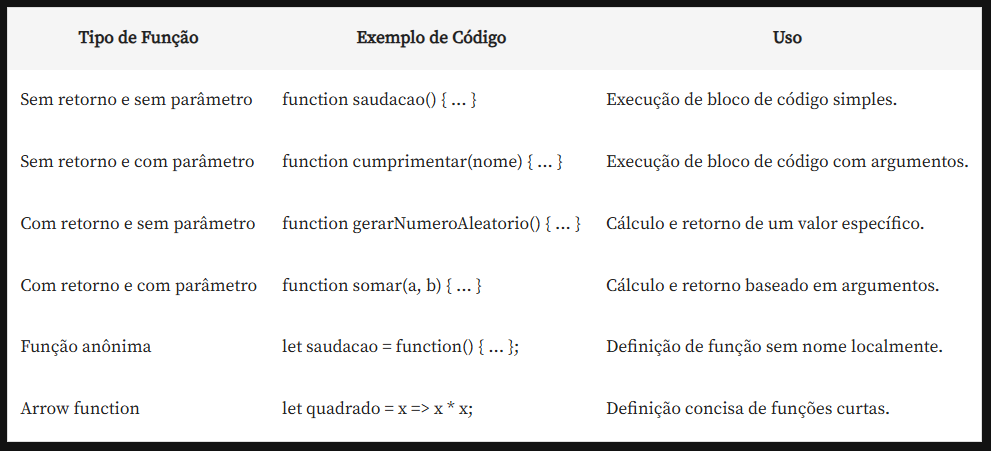

# Lógica de programação: explore funções e listas
## Interação 

Criando funções
O que é uma função? Trecho de código responsável por determinada ação
                    Boa nomenclatura
javascript -> html
acoplamento
chamar função no html

Funções com retorno, sem parâmetro e com parâmetro

